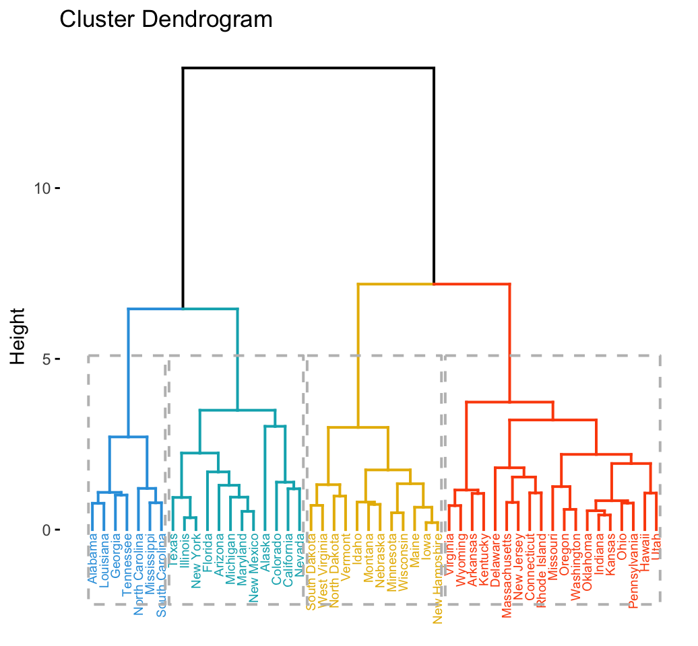

# Leveraging the Power of Transfomers
# for Log Supervision

A quick overview over the project I was assigned from May to July 2023

---
# Quick overview
1. Problem at hand
2. Log Reduction
3. Logbook Reports
4. Future Work

---
# Problems at hand
- Logs can be tedious to read, even with a good filters 
    - similar messages but not exact matches, makes it harder to filter.
    - also very repetitive on multiple hosts.
- Adding an entry to the logbook can be useful to keep track of the issues that could be encountered later, but we cannot store them forever.
- It can be easier to inteact with the logs with plain text
---
# Log Reduction
To tackle the problem of repetetive logs we chose to use a sentence transformer to vectorise the logs and a hierarchical clustering to group similar logs together.

 

---

# Results on sytem logs errors and warnings
### Before

### After

---
#show a few entries of the csv

---
# Logbook Reports
- Use the hourly summaries, re-vectorise them and cluster them again to get a summary of the day.
    - alot of logs also repeat throughout the day, so we can use the same method to reduce the number of logs again.
- Use an LLM to generate a summary of the day in sentences, while trying to keep the relevant information.
- We tried a few open-source models and ran them locally for privacy reasons, but the results were not satisfying.
- For demonstration purposes we used the OpenAI's GPT-3.5

---
**System Log Report - July 12, 2023**

**Morning (00:00 - 08:59):**

The day began with several errors logged across different hosts. At midnight, the server n2201703 experienced a failure in the systemd-coredump service, resulting in a failed step and a read-only file system error. Another server, cronl03, reported a BIOS error related to the iwlwifi device.

In the early hours, the server lab14 encountered a forbidden error while checking for jobs, possibly due to access restrictions for the runner 'mv72UWrp.' Additionally, the server uceb13 reported a device detection error, suggesting the need for bus re-enumeration.

On cradm01, multiple issues occurred simultaneously. The process python2.7 was killed by an unsupported signal, the bluez5-util.c failed to retrieve ManagedObjects, and vdagent virtio channel access was denied... 

---
... Around 8:40 AM, uceb10 experienced an error related to network interface renaming, while crot02 failed to start the LSB service responsible for networking. A problem with the specified group 'plugdev' was also recorded on crot02.

**Late Morning (09:00 - 11:59):**

The server n6093103 encountered a connection refusal while attempting to send a WATCHDOG=1 notification message. Daqv0207 experienced a timeout while waiting for the primary device, and n8190704 reported a crash that was not saved in the specified file.

Meanwhile, loadbalancer-pluscc faced issues with the mailer process when attempting to mail the output of the `cron.daily` job. These errors might have affected the regular operation of the system.

---
# "Future Work"

    

        <ul>
        <li> Worked on the idea of a chatbot answering questions specific to the logs
        <li>  Main issue with this is finding the relevant information to the question:
            <ul>
            <li> LLM do not support huge inputs
            <li> This is usually tackled with vectorisation and cosine similarity search with the question
            </ul>
        <li> Train a good vectorization transformer adapted for logs. (Most models are made to match things like synonyms and not log that are repetive)
        </ul>
    

    

        
    

--- 
# Quick Demo of method 2
- Using Langchain
- Give the LLM a Prompt telling it how it can access a table and access its information
- Tell it how it should go through with thought processes.
- Add the relevant question.
- Let it generate sequentially new “thoughts”
- Limitations on the complexity of the question. Need more specific training on log understanding
- The most complicated things you can ask is a simple, what happened to host xyz and it can find the logs specific to the question and summarize them a bit.
- The problem is if too many things happened, not everything can fit in the model input, so there needs to be a form a compression.

---
#add image of conv

---
# Thank you for your attention

---
Technical slides

---

